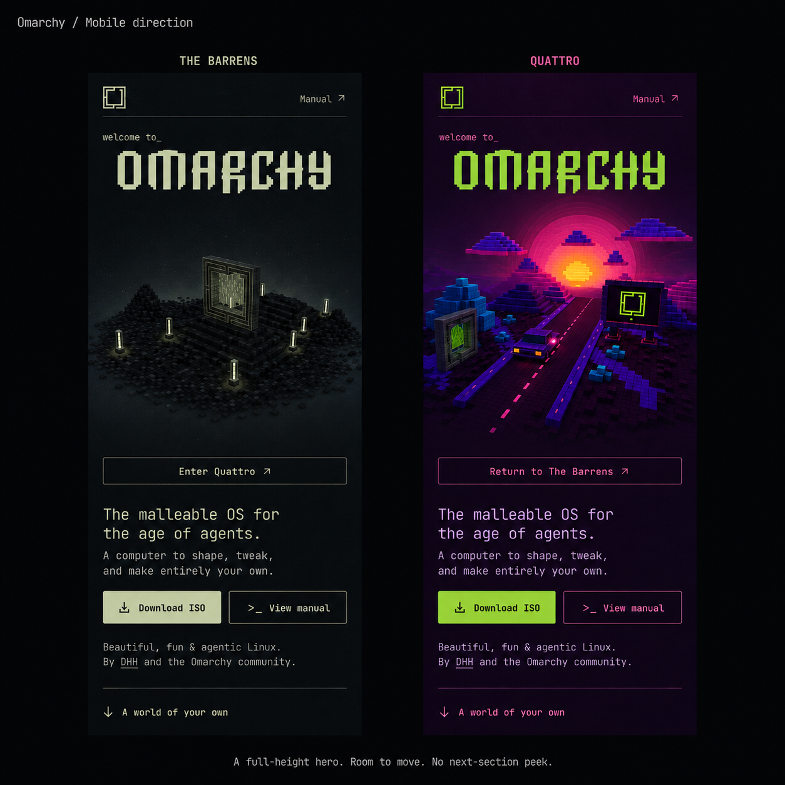

# Mobile hero direction

Status: implemented and approved for publication on 2026-09-07. Local preview: http://localhost:4175/. Deployment target: https://omarchy-homepage-redesign.proyecto-viviana.workers.dev/.

## Approved requirement

The first mobile viewport must show only the hero, with no preview of the following section. This applies to all supported phone sizes, both worlds, saved-world return visits, portrait and landscape.

## Visual proposal

Generated using the built-in image-generation tool from the existing screenshot, Omarchy branding and scene exports. This is an art-direction sketch, not a browser screenshot or a pixel-accurate implementation. Generation prompts are saved in [image-prompts.md](image-prompts.md). The revised image supersedes the first draft, which showed the next section.

- Compact header: logo at left, Manual at right. Keep Download ISO as the main hero action; remove the duplicate mobile header download.
- Give the wordmark and centered scene a dedicated composition area in normal document flow. Preserve the wordmark's native proportions. Do not reserve scene space with heading minimum heights or position it past the right edge.
- Scene atmosphere flows into the entire page. Maintain the desaturated Barrens and colorful Quattro identities.
- Place a persistent, clearly labeled world-switch control below the art. Portal geometry remains directly tappable. Both controls invoke the same action. Use at least 44px touch targets.
- Match all text, control and scene-region positions in both worlds. Switching changes the world and atmosphere without changing document geometry.
- Keep comfortable mobile text sizes and 48px download/manual buttons. Use regular spacing between related elements.
- Anchor the scroll cue near the bottom of the hero with safe-area padding; the next section begins below the hero. Keep all existing destination links accessible even if supplementary copy is relocated.

## Viewport and height behavior

Use a minimum hero height that tracks the visible viewport, with a `100vh` fallback and modern `100dvh` override. Account for safe-area insets inside that height with border-box sizing. A `100svh` minimum alone can expose the next section when browser controls retract.

Allow the hero to grow beyond the viewport when short screens, landscape orientation, larger text or zoom require more space. Do not crop content, shrink text below comfortable sizes, or create a nested scroll container to force every element into one screen. On those screens the first viewport still contains only the hero.

Keep the scene's rendering region stable while browser toolbars expand or collapse; distribute additional hero space outside that region. Resize the camera and drawing buffer for genuine width/orientation changes, avoiding unnecessary reallocations during world travel.

Use a shared compact-layout condition in CSS and the renderer that includes landscape phones. Crossing 800px width while rotating a phone must not suddenly activate the desktop cinematic geometry.

## Motion proposal

Keep both existing settled camera endpoints as the initial reference; fix placement first. Provide sufficient render margins around all important geometry, including the portal, car and foreground corners.

Use a mobile-specific travel curve with a shallow approach and restrained lateral rotation, fitting the stable scene region throughout. Keep the existing threshold veil and world-commit timing. A camera passing through the portal intentionally fills the view; accidental hard cropping of the diorama at its rectangular host must be eliminated.

The concept image does not prove animation framing. Validate the entire motion envelope in both directions, including the widest rotation, before considering the clipping issue resolved.

Preserve the existing loader/presentation state machine, GPU readiness barrier, reduced-motion/static fallback behavior, crawler-readable content, first visit in The Barrens without automatic animation, and remembered world.

## Observed causes

At 390 × 844 before this implementation:
- Hero height: approximately 707px, allowing the next section into the first viewport.
- Scene host: x=78.7px, width=339.3px, ending at x=418px on a 390px screen.
- The scene host clips overflow and the outer page clips its offscreen edge.
- The heading reserves 230px of minimum height independently of the absolute scene.
- Phones run the same portal-travel camera curve as desktop inside their fixed small host.

Relevant files: `src/styles/stage-one.css`, `src/lib/stage-one-world.ts`, `src/components/WorldCanvas.tsx`, `src/routes/index.tsx`.

## Implementation review matrix

Check 320×568, 360×640, 375×667, 390×844, 430×932, 540×960, a compact tablet, and landscape phones including 844×390 and 932×430. Confirm toolbar changes and safe areas on a real mobile browser where possible.

For each representative size:
- No next-section pixels in the first viewport, no horizontal scroll, and no hidden text or controls.
- Both settled worlds, both transition directions, the widest camera rotation and skip behavior.
- No document-height change during travel.
- Fresh loading, saved-world reload, reduced motion and static fallback.
- Larger text/zoom remains readable and scrollable.
- Desktop retains its approved layout and motion.

The automated inspection used a software WebGL renderer and is evidence for geometry only, not native phone frame performance.

## Implemented and checked

The compact hero now places its wordmark, centered scene, world switch, copy and actions in document flow. Its minimum height follows the viewport; short screens can scroll through the hero before reaching the next section. The switch reserves a stable 44px row while loading or travelling. Coarse-pointer landscape phones use a two-column arrangement with the scene and switch beside the copy.

CSS and the renderer share the compact-layout flag. Compact portal travel uses a direct, continuous approach, crossing and arrival while preserving the existing settled cameras and world-commit timing. Desktop keeps its existing camera path. The skip link targets the hero heading, which retains a rendered box in the compact layout.

Validation completed:
- Typecheck and production build pass.
- Controller, preferences, presentation, scene-visibility and compact-camera test files pass.
- Static fallback layout checks pass at seven portrait sizes from 320×568 to 768×1024 and three touch landscape sizes: 667×375, 844×390 and 932×430. No horizontal overflow or next-section preview; the scene and world-switch bounds stay within the viewport width.
- Landscape screenshots show the complete scene and switch within the first viewport. Short-screen copy remains scrollable.
- The main landmark remains accessible, and the skip link focuses the hero heading.
- Live WebGL checks at 390×844 complete both portal directions with identical hero, scene and switch bounds throughout the sampled states. Copy becomes inert during travel, then focus returns to the world switch. Both settled worlds were visually inspected.
- A 1440×900 desktop check retains the desktop camera flag, full-height hero and no horizontal overflow.

Real-device browser chrome, safe-area behavior and native GPU frame performance still need device review.
